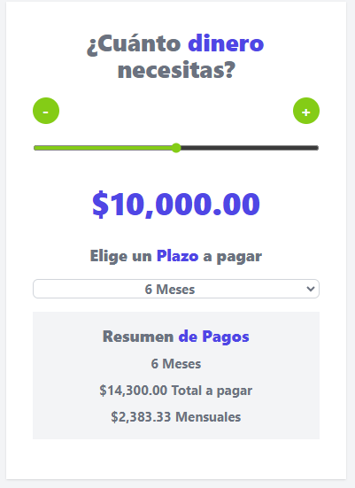

<h1>Cotizador Prestamos React  🏦💰</h1>

## Descripción 
Breve proyecto aplicando react con vite, donde puse en practica hook como useEffect y useState, para manejar eventos
## Autor ✒️
**Yechua Silva**

* [LinkedIn](https://www.linkedin.com/in/yechua-silva/)

## Ver ejemplo en vivo 
- [https://cotizador-prestamos-react-yechua.netlify.app/](https://cotizador-prestamos-react-yechua.netlify.app/)

## Instalación 
- Clone el repositorio en su maquina  
- Luego instale las dependencias en la carpeta del proyecto  
    <code> npm install </code>
- Con  <code> npm run dev </code>  ejecuta el proyecto como dependecia de desarrollo en localhost
- Con  <code> npm run build </code>   mueve el proyecto para produccion
  
## Contratación
Si estás interesado en contratarme, puedes ponerte en contacto conmigo escribiendo a yechua-silva@outlook.cl para cualquier consulta o solicitud.
